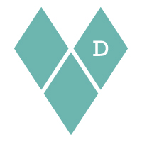
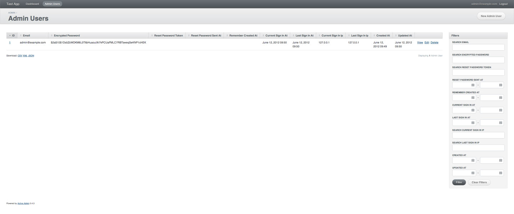
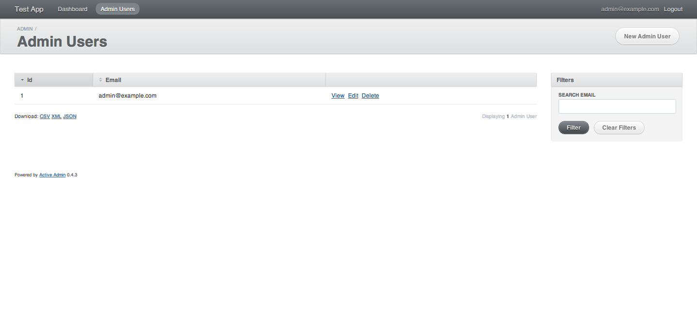
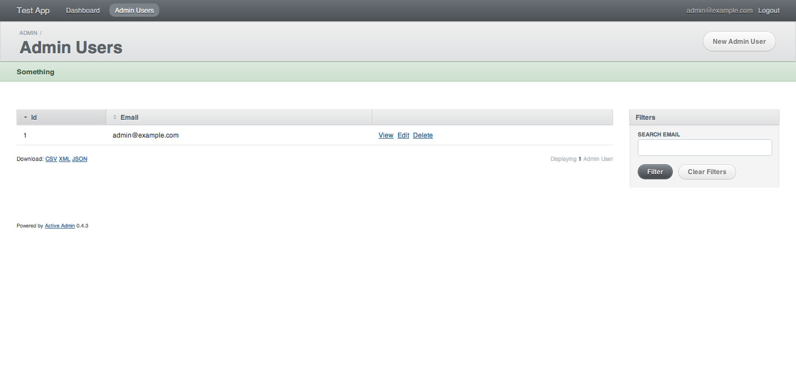

<!SLIDE bullets>

# ActiveAdmin #
* WAAW, Marseille, le 12 juin 2012

<!SLIDE bullets transition=scrollUp>

* David Authier

<!SLIDE transition=scrollUp>

# ActiveAdmin 
# qu'est-ce que c'est ?

<!SLIDE bullets transition=scrollUp>

* Un framework pour créé des admins
* Un DSL pour construire votre interface
* Une solution pour mettre en place un back office rapidement

<!SLIDE transition=scrollUp>

# Installation

<!SLIDE bullets incremental transition=scrollUp>

* On ajoute la gem au Gemfile
* On lance l'installation via le générateur : __rails g active_admin:install__
* On exécute les migrations et c'est prêt ! 

<!SLIDE transition=scrollUp>

# Administrons une ressource 

<!SLIDE bullets incremental transition=scrollUp>

# Une commande simple :
* __rails g active_admin:resource AdminUser__
* On peut maintenant administrer cette ressource

<!SLIDE bullets transition=scrollUp>

# Surcharger le fonctionnement par défaut

<!SLIDE bullets incremental transition=scrollUp>

__app/admin/admin_users.rb__

    @@@ ruby
    
    ActiveAdmin.register AdminUser do
    
    end

<!SLIDE full-page transition=scrollUp>

<!SLIDE transition=scrollUp>

__app/admin/admin_users.rb__

    @@@ ruby
    
    ActiveAdmin.register AdminUser do
      filter :email
    
      index do 
        column :id
        column :email
        default_actions
      end
    end

<!SLIDE full-page transition=scrollUp>

<!SLIDE transition=scrollUp>

# Mais on ne peut toucher que l'affichage ?

<!SLIDE transition=scrollUp>

__app/admin/admin_users.rb__

    @@@ ruby
    
    ActiveAdmin.register AdminUser do
      action_item :only => :show do
        a 'Something', :href => 
          something_admin_admin_user_path(admin_user.id)
      end 
      
      member_action :something do
        user = AdminUser.find(params[:id])
        # do something !
        flash[:notice] = 'Something'
        redirect_to :action => :index
      end
    end

<!SLIDE full-page transition=scrollUp>

<!SLIDE transition=scrollUp>

# Et c'est tout ce que l'on peut faire ?

<!SLIDE bullets incremental transition=scrollUp>

* Surcharger les controllers ([inherited_resources](https://github.com/josevalim/inherited_resources))
* Modifier les formulaires ([formtastic](https://github.com/justinfrench/formtastic))
* Customiser la façon de se connecter ([devise](https://github.com/plataformatec/devise))
   
<!SLIDE transition=scrollUp>

# Et si cela ne suffit pas ?

<!SLIDE transition=scrollUp>

__config/initializers/active_admin.rb__

    @@@ ruby

    module ActiveAdmin
      module Comments
        module Views
          class Comments < ActiveAdmin::Views::Panel
            def build_comment(comment)
              div :for => comment do
                div :class => "active_admin_comment_meta" do
                  user_name = comment.author ? auto_link(comment.author) : "Anonymous"
                  h4(user_name, :class => "active_admin_comment_author")
                  div render :partial => '/partials/comment_link', :locals => { :comment => comment }
                  span(pretty_format(comment.created_at))
                end
                div :class => "active_admin_comment_body" do
                  simple_format(comment.body)
                end
                div :style => "clear:both;"
              # etc…
              
<!SLIDE bullets transition=scrollUp>

# La suite sa se passe sur
* [activeadmin.info](http://activeadmin.info/)

<!SLIDE bullets transition=scrollUp>

# Pour ceux qui ne connaissent pas encore
* [bonjourgem.com](http://www.bonjourgem.com)

<!SLIDE bullets transition=scrollUp>

# Crédits
* Slides créés avec ShowOff
* [github.com/schacon/showoff](https://github.com/schacon/showoff)

<!SLIDE bullets transition=scrollUp>

# Merci pour votre attention
* [webdesigner-developpeur-marseille.com](http://www.webdesigner-developpeur-marseille.com)
* [@david_authier](https://twitter.com/#!/david_authier)

