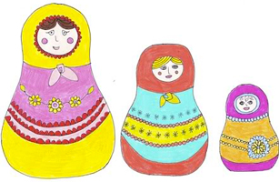
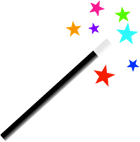
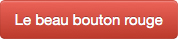

<!SLIDE bullets>
 
# Introduction à Sass
* [pastis.rb](http://pastisrb.org)
* WAAW, Marseille, le 25 juillet 2012

<!SLIDE bullets transition=turnUp>

# Maylis Agniel
* 25 ans, designer UX
* Design, front-end dév HTML / CSS

<!SLIDE bullets transition=turnUp>

# Qu'est-ce que Sass ?
* Syntactically Awesome Stylesheets
* Préprocesseur CSS

<!SLIDE bullets transition=turnUp>

# Pourquoi Sass est sexy ?
* Étendre les possibilités de CSS
* Approche DRY, simplicité et élégance du code
* Gagner en temps et en efficacité
* Feuilles de style maintenables

<!SLIDE bullets transition=turnUp>

# Comment ça fonctionne ?
* Fichier Sass => compilé => fichier CSS

<!SLIDE bullets transition=turnUp>

# Au programme
* Règles imbriquées
* L'exemple Facebook
* Mixins
* Héritage de classe

<!SLIDE bullets transition=turnUp>

# Règles imbriquées

<!SLIDE bullets transition=turnUp>

# Un menu de navigation
* Je veux le styler sans me prendre la tête

<!SLIDE bullets transition=turnUp>

# HTML

    @@@html
    
    <ul>
      <li>
        <a href="#">Blog</a>
      </li>
      <li>
        <a href="#">À propos</a>
      </li>
      <li>
        <a href="#">Contact</a>
      </li>
    </ul>

<!SLIDE bullets transition=turnUp>

# Sass
  
    @@@css
    
    ul
      list-style: none
      li
        float: left
        a
          color: #333
          text-decoration: none
          &:hover
            color: #666

<!SLIDE bullets transition=turnUp>

# CSS
  
    @@@css
    
    ul {
      list-style: none;
    }
    ul li {
      float: left;
    }
    ul li a {
      color: #333;
      text-decoration: none;
    }
    ul li a:hover {
      color: #666;
    }            
  
<!SLIDE bullets transition=turnUp>

# Vous avez vu, c'est simple
* On continue !
      
<!SLIDE bullets transition=turnUp>

# Les variables
* (l'exemple Facebook)

<!SLIDE bullets transition=turnUp>

# HTML

    @@@html
    
    <header>
      
Ce header est bleu

    </header>
    

      <h1>Ce titre est bleu</h1>
      <a href="#">Et ce bouton aussi !</a>
    

<!SLIDE bullets transition=turnUp>

# Sass
  
    @@@css
    
    // Je definis une variable
    // avec pour valeur le fameux bleu
    $facebook-color: #3B5998
    
    header
      background-color: $facebook-color
    h1
      color: $facebook-color
    a
      color: #fff
      background-color: $facebook-color

<!SLIDE bullets transition=turnUp>

# CSS
  
    @@@css
    
    header {
      background-color: #3B5998;
    }
    h1 {
      color: #3B5998;
    }
    a {
      color: #fff;
      background-color: #3B5998;
    }

<!SLIDE bullets transition=turnUp>

# Imaginez
* Du jour au lendemain FB veut tout passer en rouge !

<!SLIDE bullets transition=turnUp>

# Sass
  
    @@@css
    
    // Je remplace le bleu par du rouge
    $facebook-color: #ea1832
    
    header
      background-color: $facebook-color
    h1
      color: $facebook-color
    a
      color: #fff
      background-color: $facebook-color

<!SLIDE bullets transition=turnUp>

# CSS
  
    @@@css
    
    header {
      background-color: #ea1832;
    }
    h1 {
      color: #ea1832;
    }
    a {
      color: #fff;
      background-color: #ea1832;
    }

<!SLIDE bullets transition=turnUp>

# Les mixins
* ou le copier-coller magique

<!SLIDE bullets transition=turnUp>

# Un exemple
* Je souhaite déstyler plusieurs listes dans un document
* Je ne vais pas recopier mon style à chaque fois !

<!SLIDE bullets transition=turnUp>

# HTML

    @@@html
    
    <header>
      <ul>
        <li>Élément de liste</li>
        <li>Élément de liste</li>
        <li>Élément de liste</li>
      </ul>
    </header>
    <footer>
      <ul>
        <li>Élément de liste</li>
        <li>Élément de liste</li>
      </ul>
    </footer>

<!SLIDE bullets transition=turnUp>

# Sass
  
    @@@css
    
    // Je definis mon mixin
    // pour destyler les listes
    @mixin reset-list
      list-style: none
      margin: 0
      padding: 0
      li
        margin: 0
        padding: 0
    
    header
      ul
        @include reset-list
    footer
      ul
        @include reset-list

<!SLIDE bullets transition=turnUp>

# CSS
  
    @@@css
    
    header ul {
      list-style: none;
      margin: 0;
      padding: 0;
    }
    header ul li {
      margin: 0;
      padding: 0;
    }
    footer ul {
      list-style: none;
      margin: 0;
      padding: 0;
    }
    footer ul li {
      margin: 0;
      padding: 0;
    }
    
<!SLIDE bullets transition=turnUp>

# Encore plus fort !
# @extend
* ou l'héritage de classe

<!SLIDE bullets transition=turnUp>

# Des coins arrondis
* un peu partout dans mon document

<!SLIDE bullets transition=turnUp>

# HTML

    @@@html
    
    

      
Boîte avec des coins arrondis

    

    

      <form>
        <input type="text" placeholder="Champ texte idem">
        <button type="submit">Et le bouton pareil</button>
      </form>
    

<!SLIDE bullets transition=turnUp>

# Sass
  
    @@@css
    
    // Je definis ma classe coins arrondis
    .rounded
      -webkit-border-radius: 3px
      -moz-border-radius: 3px
      border-radius: 3px
      
    .box
      @extend .rounded
    input[type="text"]
      @extend .rounded
    button
      @extend .rounded

<!SLIDE bullets transition=turnUp>

# CSS
  
    @@@css
    
    .rounded,
    .box,
    input[type="text"],
    button {
      -webkit-border-radius: 3px;
      -moz-border-radius: 3px;
      border-radius: 3px;
    }

<!SLIDE bullets transition=turnUp>

# Double avantage
* On automatise les tâches répétitives (ouf)
* Feuille de style + courte donc + légère

<!SLIDE bullets transition=turnUp>

# La cerise sur le gâteau
* (qui va plaire aux designers)

<!SLIDE bullets transition=turnUp>

# Le truc classique
* Ce joli bouton rouge.
* Quand je passe la souris dessus, il fonce ?
* Et en actif, il devient plus clair, pas vrai ?

<!SLIDE bullets transition=turnUp>

# Opérations sur les couleurs
* Oui Monsieur, on peut le faire !

<!SLIDE bullets transition=turnUp>

# HTML

    @@@html

    <a href="#">Le beau bouton rouge</a>

<!SLIDE bullets transition=turnUp>

# Sass
  
    @@@css
    
    // Je definis une couleur pour les liens
    $link: red
    
    a
      color: #fff
      background-color: $link
      &:hover
        background-color: darken($link, 20%)
      &:active
        background-color: lighten($link, 20%)

<!SLIDE bullets transition=turnUp>

# CSS
  
    @@@css
    
    a {
      color: #fff;
      background-color: red; 
    }
    a:hover {
      background-color: #990000; 
    }
    a:active {
      background-color: #ff6666; 
    }
    
<!SLIDE bullets transition=turnUp>

# Autres opérations
* Mélange
* Transparence, opacité
* Saturation

<!SLIDE bullets transition=turnUp>

# Tout ça c'est facile
* Pas vrai ?

<!SLIDE bullets transition=turnUp>

# Conclusion
* Les développeurs sont des feignants, prenons exemple !
* Les designers ne doivent pas avoir peur du code
* Et non plus de la ligne de commande
* Ils sont leurs amis !

<!SLIDE bullets transition=turnUp>

# Et ensuite ?
* Il y a Compass
* Rendez-vous à la prochaine présentation !

<!SLIDE bullets transition=turnUp>

# Ressources
* Le livre pour tout savoir sur Sass par [@kaelig](https://twitter.com/#!/@kaelig) [FR]
* [css-maintenables.fr](http://www.css-maintenables.fr)
* Site officiel Sass
* [sass-lang.com](http://sass-lang.com)
* Documentation Sass par [@kaelig](https://twitter.com/#!/@kaelig)
* [kaelig.fr/bettersassdocs/](http://www.kaelig.fr/bettersassdocs/)

<!SLIDE bullets transition=turnUp>

# Merci pour votre attention
* [@mmaayylliiss](https://twitter.com/#!/mmaayylliiss)