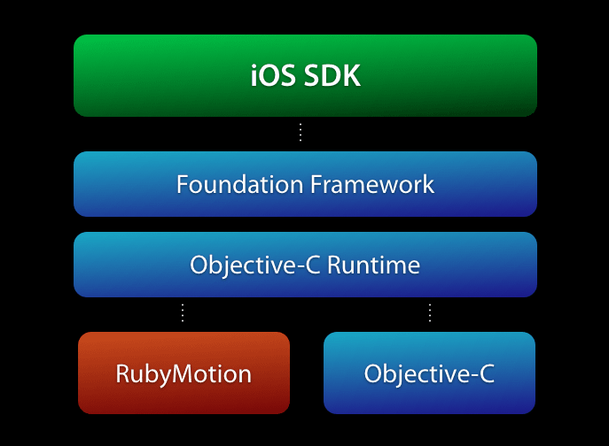

<!SLIDE bullets>
 
# RubyMotion
* [pastis.rb](http://pastisrb.org)
* WAAW, Marseille, le 12 septembre 2012

<!SLIDE bullets transition=turnUp>

# Joffrey Jaffeux
* Développeur

<!SLIDE transition=turnUp>

<!SLIDE bullets transition=turnUp>

# Qu'est-ce que c'est ?
* Laurent Sansonetti @lrz
* MacRuby
* Ruby 1.9
* Aussi natif que le natif

<!SLIDE bullets transition=turnUp>

# Comment ça marche ?
* Unified Runtime
* Compilation Statique
* Ruby -> Syntax Tree -> LLVM IR -> 
* Assembly -> Machine Code

<!SLIDE bullets transition=turnUp>

<!SLIDE bullets transition=turnUp>

# Principales features
* Terminal workflow
* REPL
* Tests
* Editeur de son choix
* Et c'est toujours en Ruby :)

<!SLIDE transition=turnUp>

# Terminal Workflow

<iframe width="560" height="315" src="http://www.youtube.com/embed/z3DEzICC2ro" frameborder="0" allowfullscreen></iframe>

<!SLIDE transition=turnUp>

# REPL
  
<iframe width="420" height="315" src="http://www.youtube.com/embed/b8RK-S9LsJo" frameborder="0" allowfullscreen></iframe>

<!SLIDE transition=turnUp>

# Tests
  
<iframe width="560" height="315" src="http://www.youtube.com/embed/K1vjK0KhteM" frameborder="0" allowfullscreen></iframe>         
  
<!SLIDE bullets transition=turnUp>

# Getting started
* Achat 160 €
* D/L package et installation
* rake
      
<!SLIDE bullets transition=turnUp>

# Anatomie d'un projet

* image manquante !

<!SLIDE bullets transition=turnUp>

# Dépendances
  
* Lib Ruby ou Objective-c
* Gemfile
* Podspec

<!SLIDE transition=turnUp>

# Comparaison code Ruby / Objective-c

<!SLIDE bullets transition=turnUp>

# Ruby
  
    class Hello
      attr_accessor :what
      
      def initialize(what)
        @what = what
      end
      
      def say
        puts "hello #{what}"
      end
    end
    
<!SLIDE bullets transition=turnUp>

# Objective-c 

    #import <Foundation/Foundation.h>
    
    @interface Hello
    {
      NSString *what;
    }
    
    @property(copy) NSString *what;
    
    - (id)initWithWhat:(NSString *)what;
    - (void)say;
    
    @end
    
<!SLIDE bullets transition=turnUp>

# Objective-c 

    #import "Hello.h"

    @implementation Hello
    
    @synthetize what;
    
    - (id)initWithWhat:(NSString *)what
    {
      self = [super init];
      if (self != nil){
        [self setWhat:what];
      }
      return self;
    }
    - (void)say
    {
      NSLog(@"Hello %@", what)
    }
    
    @end

<!SLIDE bullets transition=turnUp>

# Divers
  
* Faut-il connaître la stack iOS/Objective-C : Oui
* Puis-je utiliser les gems : Non
* Ai-je accès à toutes les fonctions ruby : Non
* Ai-je accès à toute l'API : Oui
* Puis-je utiliser Xcode : Oui 

<!SLIDE bullets transition=turnUp>

# Avenir (proche)
  
* Communauté grandissante
* Meilleur debugging
* DSL matures (bubble-wrap, sugarcube, formotion, testflight…)

<!SLIDE bullets transition=turnUp>

# Ressources
* Ruby Motion Google group
* [rubymotion.com](http://www.rubymotion.com/)
* Motion support
* [@rubymotion](https://twitter.com/RubyMotion)
* [rubymotion-tutorial.com](http://rubymotion-tutorial.com/)
* github

<!SLIDE bullets transition=turnUp>

# À suivre également
* mruby
* MobiRuby
* Ruboto

<!SLIDE bullets transition=turnUp>

# Merci pour votre attention
* [@joffreyjaffeux](https://twitter.com/joffreyjaffeux)