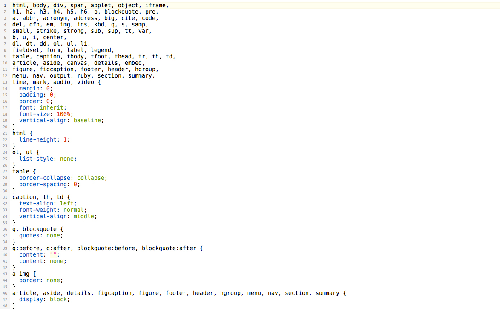
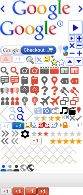

<!SLIDE bullets>
 
# Introduction à Compass
* [pastis.rb](http://pastisrb.org)
* La Passerelle, Marseille, le 14 novembre 2012

<!SLIDE bullets transition=turnUp>

# Maylis Agniel
* Designer, front-end développeur

<!SLIDE bullets transition=turnUp>


# Qu'est-ce que Compass ?
* Framework CSS pour Sass

<!SLIDE bullets transition=turnUp>

# Sass
* Préprocesseur CSS
* Étend les possibilités de CSS

<!SLIDE bullets transition=turnUp>

# Comment ça fonctionne ?
* Fichier Sass => compilé => fichier CSS

<!SLIDE bullets transition=turnUp>

# Pourquoi utiliser Compass ?
* Encore plus puissant et productif
* Tout un tas de mixins et d'extensions
* Facilite l'emploi de CSS3

<!SLIDE bullets transition=turnUp>

# Installation

  ```
    $ gem install compass
  ```
  
<!SLIDE bullets transition=turnUp>

# Créer un projet

  ```
    $ compass create
  ```

<!SLIDE bullets transition=turnUp>

# Au programme
* Reset.css en une ligne
* Calculer les dimensions d'une image
* CSS3 oui, mais sans préfixer
* Les sprites sans se prendre la tête

<!SLIDE bullets transition=turnUp>

# Je veux inclure un reset.css

<!SLIDE bullets transition=turnUp>

# Sass
  
    @@@css
    
    @import "compass/reset"

<!SLIDE bullets transition=turnUp>

# CSS

<!SLIDE full-page bullets transition=turnUp>

       

<!SLIDE bullets transition=turnUp>

# J'ai une image 
* Je veux en savoir les dimensions

<!SLIDE bullets transition=turnUp>

# Sass
  
    @@@css
    
    #logo
      width: image-width('logo.png')
      height: image-height('logo.png')

<!SLIDE bullets transition=turnUp>

# CSS
    
    @@@css

    #logo {
      width: 200px;
      height: 80px;
    }

<!SLIDE bullets transition=turnUp>

# CSS3 sans préfixe, ouf !

<!SLIDE bullets transition=turnUp>

# Sass
  
    @@@css
    
    @import "compass/css3/border-radius"

    .bord-arrondi
      @include border-radius(5px)

<!SLIDE bullets transition=turnUp>

# CSS
    
    @@@css
    
    .bord-arrondi {
      -webkit-border-radius: 5px;
      -moz-border-radius: 5px;
      -ms-border-radius: 5px;
      -o-border-radius: 5px;
      border-radius: 5px;
    }

<!SLIDE bullets transition=turnUp>

# Les sprites, longue histoire

<!SLIDE bullets transition=turnUp>



<!SLIDE bullets transition=turnUp>

# Un répertoire icon/
* 4 images dedans

<!SLIDE bullets transition=turnUp>

# Sass
  
    @@@css
    
    @import "icon/*.png"
    @include all-icon-sprites

<!SLIDE bullets transition=turnUp>

# CSS
    
    @@@css

    .icon-sprite,
    .icon-delete,
    .icon-edit,
    .icon-new,
    .icon-save {
      background: url(/images/icon-s34fe0604ab.png) no-repeat;
    }
    .icon-delete { background-position: 0 0; }
    .icon-edit { background-position: 0 -32px; }
    .icon-new { background-position: 0 -64px; }
    .icon-save { background-position: 0 -96px; }

<!SLIDE bullets transition=turnUp>

# Quelques extensions
* 960 grid system
* HTML5 Boilerplate
* Twitter Bootstrap
* Foundation

<!SLIDE bullets transition=turnUp>

# Conclusion
* Toujours moins d'efforts grâce à Compass !

<!SLIDE bullets transition=turnUp>

# Ressources
* Site officiel Compass
* [compass-style.org](http://compass-style.org)
* Compass, sauvez l'intégrateur ! [FR]
* [pioupioum.fr/compass-sauvez-integrateur](http://pioupioum.fr/compass-sauvez-integrateur/)
* Liste des extensions
* [github.com/chriseppstein/compass/wiki/Compass-Plugins](https://github.com/chriseppstein/compass/wiki/Compass-Plugins)

<!SLIDE bullets transition=turnUp>

# Merci pour votre attention
* [@mmaayylliiss](https://twitter.com/#!/mmaayylliiss)