<!SLIDE bullets>
 
# CoffeeScript 'em all!
* [pastis.rb](http://pastisrb.org)
* L'Équitable Café, Marseille, le 13 février 2013

<!SLIDE bullets transition=turnUp>

# David Authier
* Apprenti dresseur spé développement

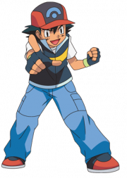

<!SLIDE bullets transition=turnUp>

# Pourquoi utiliser

* Écrire moins pour en avoir plus
* Lisibilité
* Maintenabilité

<!SLIDE bullets transition=turnUp>

# Plus de déclaration de variable

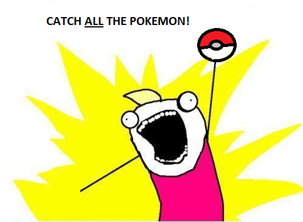

<!SLIDE bullets transition=turnUp>

## JS

    @@@ javascript
    var message;
    message = "Catch them all!";
    alert(message);

## Coffee

    @@@ javascript
    message = "Catch them all!"
    alert message

<!SLIDE bullets transition=turnUp>

# Les fonctions

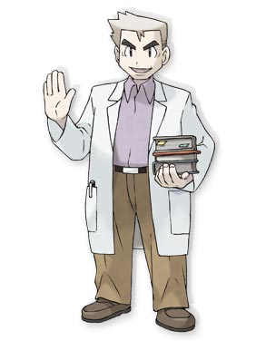

<!SLIDE bullets transition=turnUp>

## JS

    @@@ javascript
    var catch_pokemon = function(){
      return confirm("Ready for catching?");
    }

## Coffee

    @@@ javascript
    catch_pokemon = ->
      confirm "Ready for catching?"

<!SLIDE bullets transition=turnUp>

# Paramètres des fonctions

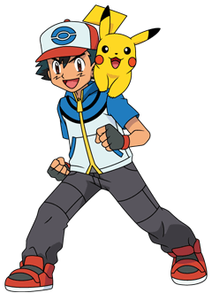

<!SLIDE bullets transition=turnUp>

## JS

    @@@ javascript
    var catch_pokemon;
    catch_pokemon = function(name) {
      return confirm("Ready for catching " + name + "?");
    };

## Coffee

    @@@ javascript
    catch_pokemon = (name) ->
      confirm "Ready for catching #{name}?"

<!SLIDE bullets transition=turnUp>

# Appels de fonctions

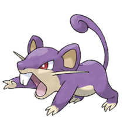

<!SLIDE bullets transition=turnUp>

## Coffee

    @@@ javascript
    catch_pokemon = ->
    # catch_pokemon()
    # do catch_pokemon

    catch_pokemon = (name) ->
    # catch_pokemon("Rattata")
    # catch_pokemon "Rattata"

    catch_pokemon = (name, level) ->
    # catch_pokemon("Rattata", 12)
    # catch_pokemon "Rattata", 12

<!SLIDE bullets transition=turnUp>

# jQuery vers CoffeeScript

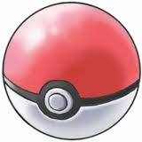

<!SLIDE bullets transition=turnUp>

## JS

    @@@ javascript
    function catch_pokemon(event){
    	event.preventDefault();
    	$("#fight-screen .pokemon")
    	.replaceWith('');
    	$(this).remove();
    }

    $("#inventory .pokeball .use").click(catch_pokemon);

<!SLIDE bullets transition=turnUp>

## Coffee

    @@@ javascript
    catch_pokemon = (event) ->    
      event.preventDefault()
      $("#fightscreeen .pokemon")
      .replaceWith ""
      $(@).remove()
    
    $("#inventory .pokeball .use").click catch_pokemon

<!SLIDE bullets transition=turnUp>

## JS

    @@@ javascript
    $("#pokedex .pokemon .icon").click(function (event){
      event.preventDefault();
    });

## Coffee

    @@@ javascript
    $("#pokedex .pokemon .icon").click (event) ->
      event.preventDefault()

<!SLIDE bullets transition=turnUp>

# Les conditions

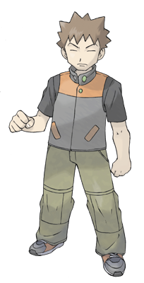

<!SLIDE bullets transition=turnUp>

## JS

    @@@ javascript
    if (age == 10){
      alert("You can be a Pokemon trainer!");
    }

<!SLIDE bullets transition=turnUp>

## Coffee

    @@@ javascript
    if age == 10
      alert "You can be a Pokemon trainer!"
      
    alert "You can be a Pokemon trainer!" if age == 10

    if age == 10 then alert "You can be a Pokemon trainer!"

<!SLIDE bullets transition=turnUp>

# Les opérateurs

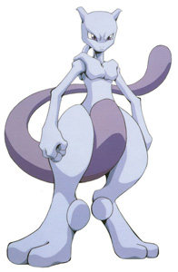

<!SLIDE bullets transition=turnUp>

<table>
  <tr>
    <td>is</td>
    <td>===</td>
  </tr>
  <tr>
    <td>isnt</td>
    <td>!==</td>
  </tr>
  <tr>
    <td>not</td>
    <td>!</td>
  </tr>
  <tr>
    <td>or</td>
    <td>||</td>
  </tr>
  <tr>
    <td>true yes on</td>
    <td>true</td>
  </tr> 
  <tr>
    <td>false no off</td>
    <td>false</td>
  </tr>
</table>

<!SLIDE bullets transition=turnUp>

## JS

    @@@ javascript
    if (all_the_pokemon() && have_met_chen() === true) {
      you_finish_pokemon();
    }

    if (!work_to_do()) {
      start_game();
    }

<!SLIDE bullets transition=turnUp>

## Coffee

    @@@ javascript
    if all_the_pokemon() and have_met_chen() is on 
    then you_finish_pokemon()

    start_game() if not work_to_do()
    #=> start_game() unless work_to_do()

<!SLIDE bullets transition=turnUp>

# Chaîner les comparaisons

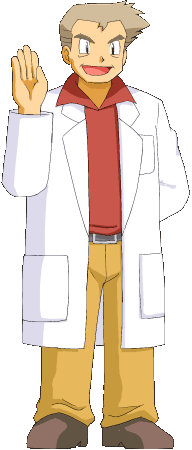

<!SLIDE bullets transition=turnUp>

## JS

    @@@ javascript
    if (100 < pokemon_count && pokemon_count < 130) {
      alert('Not so bad dummy!');
    }

## Coffee

    @@@ javascript
    if 100 < pokemon_count < 130
      alert 'Not so bad dummy!'

<!SLIDE bullets transition=turnUp>

# Opérateur existentiel

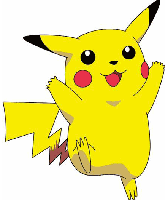

<!SLIDE bullets transition=turnUp>

## JS

    @@@ javascript
    if (typeof poke_world !== 'undefined' && poke_world 
    !== null){
      alert("They exist!");
    }

## Coffee

    @@@ javascript
    alert "They exist!" if poke_world?

<!SLIDE bullets transition=turnUp>

# Opérateur existentiel   sur les fonctions

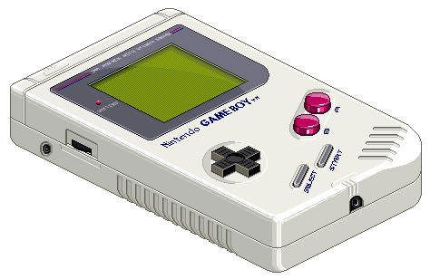

<!SLIDE bullets transition=turnUp>

## JS

    @@@ javascript
    if (typeof gameboy.start === "function") {
      gameboy.start();
    }

## Coffee

    @@@ javascript
    gameboy.start?()

<!SLIDE bullets transition=turnUp>

# Plages

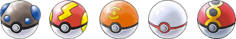

<!SLIDE bullets transition=turnUp>

## JS

    @@@ javascript
    var range = [0, 1, 2, 3, 4, 5];

## Coffee

    @@@ javascript
    range = [0..5]

<!SLIDE bullets transition=turnUp>

# Tableaux

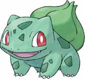

<!SLIDE bullets transition=turnUp>

## Coffee

    @@@ javascript
    pokemons = ['Bulbizarre', 'Dracaufeu', 'Pikachu']

    pokemons = [
      'Bulbizarre'
      'Dracaufeu'
      'Pikachu'
    ]

<!SLIDE bullets transition=turnUp>

# Boucles

<!SLIDE bullets transition=turnUp>

## JS

<!SLIDE bullets transition=turnUp>

    @@@ javascript
    var pokemon, _i, _j, _k, _len, _len1, _len2;
    
    for (_i = 0, _len = pokemons.length; _i < _len; _i++) {
      pokemon = pokemons[_i];
      alert("Pokemon: " + pokemon);
    }
    
    for (_j = 0, _len1 = pokemons.length; _j < _len1; _j++) {
      pokemon = pokemons[_j];
      alert("Pokemon: " + pokemon);
    }
    
    for (_k = 0, _len2 = pokemons.length; _k < _len2; _k++) {
      pokemon = pokemons[_k];
      if (pokemon !== 'Pikachu') {
        alert("Pokemon: " + pokemon);
      }
    }

<!SLIDE bullets transition=turnUp>

## Coffee

    @@@ javascript
    for pokemon in pokemons
      alert "Pokemon: #{pokemon}"
      
    alert "Pokemon: #{pokemon}" for pokemon in pokemons

    alert "Pokemon: #{pokemon}" for pokemon in pokemons
    when pokemon isnt 'Pikachu'

<!SLIDE bullets transition=turnUp>

# Objets

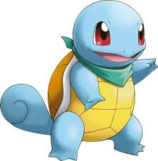

<!SLIDE bullets transition=turnUp>

## JS

    @@@ javascript
    var pokemon;
    pokemon = {
      name: 'Carapuce',
      strength: 12,
      water_gun: function() {
        return alert("" + this.name + " hurted you!");
      }
    };

<!SLIDE bullets transition=turnUp>

## Coffee

    @@@ javascript
    pokemon = 
      name: 'Carapuce'
      strength: 12
      water_gun: ->
        alert "#{@name} hurted you!"
        
    pokemon.name
    #=> Carapuce
    pokemon.water_gun
    #=> Carapuce hurted you!'

<!SLIDE bullets transition=turnUp>

# Classes

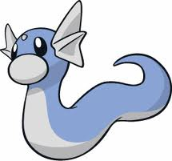

<!SLIDE bullets transition=turnUp>

## JS

<!SLIDE bullets transition=turnUp>

    @@@ javascript
    var Pokemon, minidraco;

    Pokemon = (function() {

      function Pokemon(name) {
        this.name = name;
      }

      Pokemon.prototype.cute = function() {
        return alert("" + this.name + " is so cute");
      };

      return Pokemon;

    })();

<!SLIDE bullets transition=turnUp>

## Coffee

    @@@ javascript
    class Pokemon
      constructor: (@name) ->
      cute: ->
        alert "#{@name} is so cute"
        
    minidraco = new Pokemon('Minidraco')
    minidraco.name
    #=> Minidraco
    minidraco.cute 
    #=> Minidraco is so cute

<!SLIDE bullets transition=turnUp>

# Ressources
* Site officiel CoffeeScript
* [coffeescript.org](http://coffeescript.org)
* Code School course
* [codeschool.com/courses/coffeescript](http://www.codeschool.com/courses/coffeescript)

<!SLIDE bullets transition=turnUp>

# Merci pour votre attention
* [@davidawea](https://twitter.com/#!/davidawea)

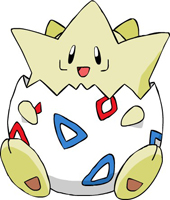