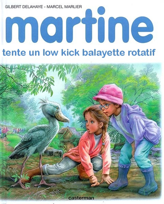

<!SLIDE bullets>
 

* [pastis.rb](http://pastisrb.org)
* La Bo[a]te, Marseille, le 17 avril 2013

<!SLIDE bullets transition=turnUp>

# David Authier

* Développeur Ruby

<!SLIDE bullets transition=turnUp>

# Quand l'utiliser ?

* Pour gérer des processus lents

<!SLIDE bullets transition=turnUp>

# Prérequis

* Redis
* Ruby ;)

<!SLIDE bullets transition=turnUp>

# Dans une application Rails

<!SLIDE bullets transition=turnUp>

## app/workers/my_worker.rb

    @@@ ruby
    class MyWorker
      include Sidekiq::Worker
      
      def perform(params1, params2)
        # do what you want here
      end
    end

<!SLIDE bullets transition=turnUp>

## somewhere/in_your/app.rb

    @@@ ruby
    MyWorker.perform_async(params1, params2)

<!SLIDE bullets transition=turnUp>

## La commande

    @@@ shell
    bundle exec sidekiq

<!SLIDE bullets transition=turnUp>

# Ce qui est cool

* &nbsp;

<!SLIDE bullets transition=turnUp>

* Différentes files d'attente et priorités
* Les middlewares
* Logging / monitoring
* Une API

<!SLIDE bullets transition=turnUp>

# Bonnes pratiques

<!SLIDE bullets transition=turnUp>

* Des petits workers simples
* Workers idempotents et transactionnels

<!SLIDE bullets transition=turnUp>

# Ressources

* Site officiel Sidekiq
* [http://sidekiq.org](http://sidekiq.org)
* Railscast
* [http://railscasts.com/episodes/366-sidekiq?view=asciicast](http://railscasts.com/episodes/366-sidekiq?view=asciicast)
* Autoscaler
* [https://github.com/JustinLove/autoscaler](https://github.com/JustinLove/autoscaler)

<!SLIDE bullets transition=turnUp>

# Merci pour votre attention

* [@davidawea](https://twitter.com/#!/davidawea)