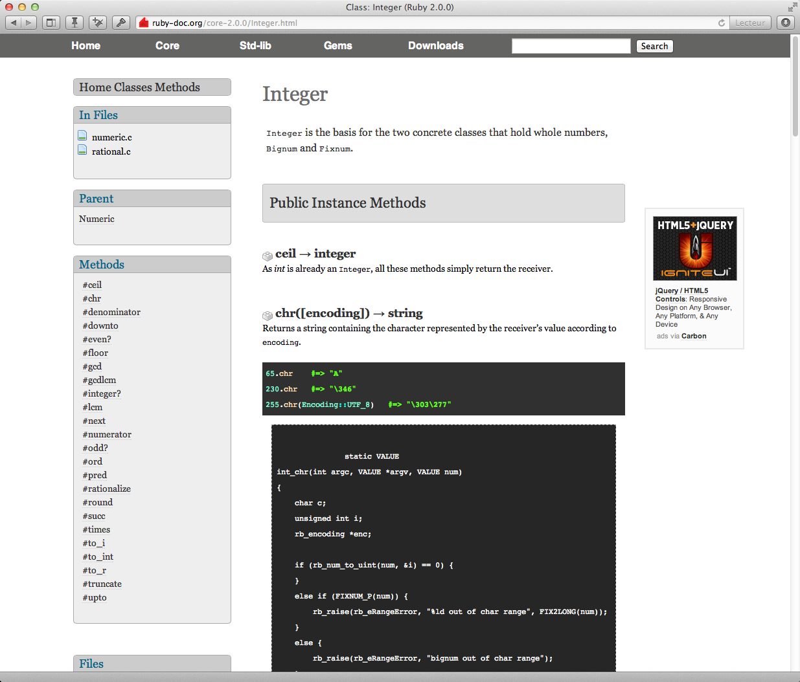

<!SLIDE bullets>
 

* [pastis.rb](http://pastisrb.org)
* La Bo[a]te, Marseille, le 11 septembre 2013

<!SLIDE bullets transition=turnUp>

# Jérémy Lecour

* Développeur Ruby

<!SLIDE bullets transition=turnUp>

# Avertissement

* Cette présentation concerne **Ruby 2.0**
* Installé via **rbenv**

<!SLIDE bullets transition=turnUp>

* **Ruby** est le nom du langage
* **ruby** est la commande ou le nom du binaire 
* servant à exécuter du code Ruby

<!SLIDE bullets transition=turnUp>

# Core vs. StdLib

<!SLIDE bullets transition=turnUp>

# Core

* Écrit en C et compilé
* Fonctionnalités principales du langage

<!SLIDE bullets transition=turnUp>

# StdLib

* Écrit en Ruby
* Bibliothèques étendant les capacités du langage

<!SLIDE bullets transition=turnUp>

# Mais où est Ruby ?

<!SLIDE bullets transition=turnUp>

# Installé via rbenv

* `~/.rbenv/versions/2.0.0-p247` 
* ou 
* `/usr/local/opt/rbenv/versions/2.0.0-p247` : notre Ruby

<!SLIDE bullets transition=turnUp>

# D'autres emplacements clés

* `bin/ruby` : le binaire compilé
* `bin/{erb,gem,irb,rake,rdoc,ri,testrb}` : des scripts en Ruby permettant d'utiliser certaines bibliothèques fournies avec Ruby
* `lib/ruby/2.0.0/` : la Standard Library
* `lib/ruby/gems/2.0.0` : les gems installées a posteriori

<!SLIDE bullets transition=turnUp>

# Accéder au code source

<!SLIDE bullets transition=turnUp>

# Core

* git clone git://github.com/ruby/ruby.git
* svn co http://svn.ruby-lang.org/repos/ruby/trunk

<!SLIDE bullets transition=turnUp>

# StdLib et gems

* Directement dans le dossier d'installation

<!SLIDE bullets transition=turnUp>

# Le code source sans effort

* [qwandry](https://github.com/adamsanderson/qwandry)
* Pour ouvrir le code source d'une bibliothèque ou d'une gem
* [bundler](http://bundler.io/)
* Pour ouvrir les gems de votre projet

<!SLIDE bullets transition=turnUp>

# Mec, t'as pas vu ma doc ?

<!SLIDE bullets transition=turnUp>

# En ligne

* [http://ruby-doc.org](http://ruby-doc.org)

<!SLIDE bullets transition=turnUp>

<!SLIDE bullets transition=turnUp>

# Hors-ligne

* Documentation texte brut ou HTML sur son poste via `Rdoc`…
* Télécharger des archives toutes faites pour ce qui vous intéresse : [ruby-doc.org/downloads/](http://ruby-doc.org/downloads/)
* [Dash](http://kapeli.com/dash)

<!SLIDE bullets transition=turnUp>

# Ressources utiles

* [Les globales](http://ruby-doc.org/core-2.0.0/doc/globals_rdoc.html) 
* [Les exceptions](http://ruby-doc.org/core-2.0.0/doc/syntax/exceptions_rdoc.html)
* [Des considérations de sécurité](http://ruby-doc.org/core-2.0.0/doc/security_rdoc.html) 

<!SLIDE bullets transition=turnUp>

# Ressource très intéressante 

* [Longue page de référence](http://www.zenspider.com/Languages/Ruby/QuickRef.html), éditée par [Ryan Davis](https://twitter.com/the_zenspider)
